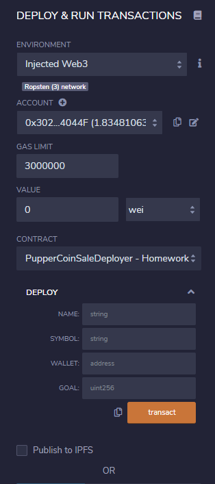
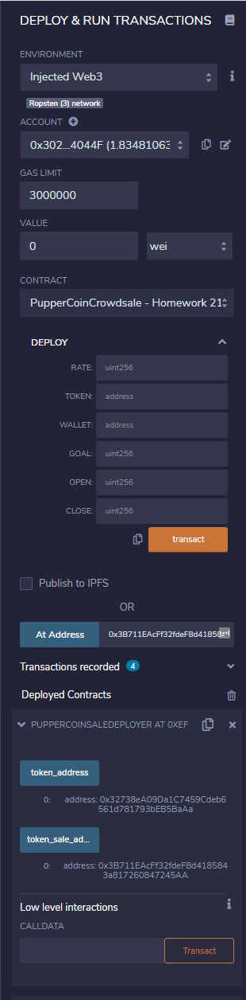
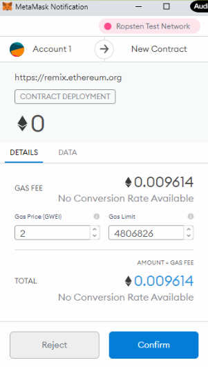
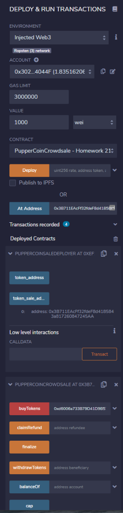
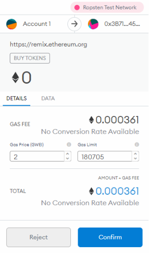
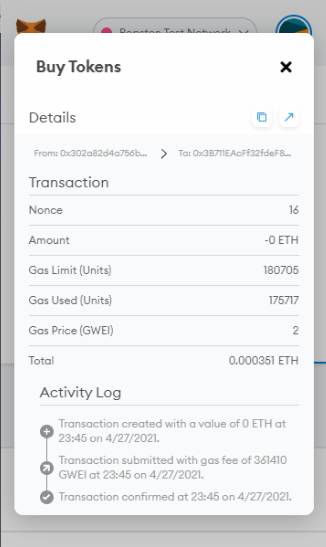
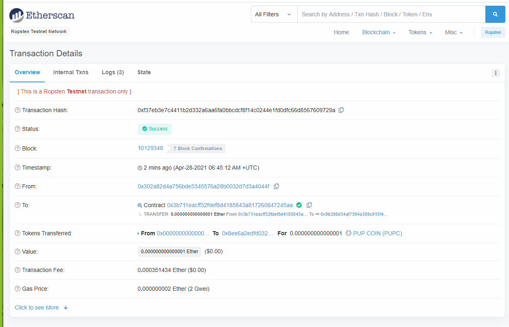
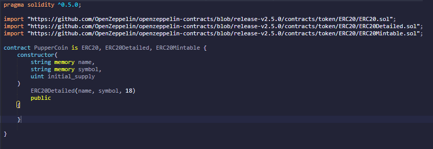
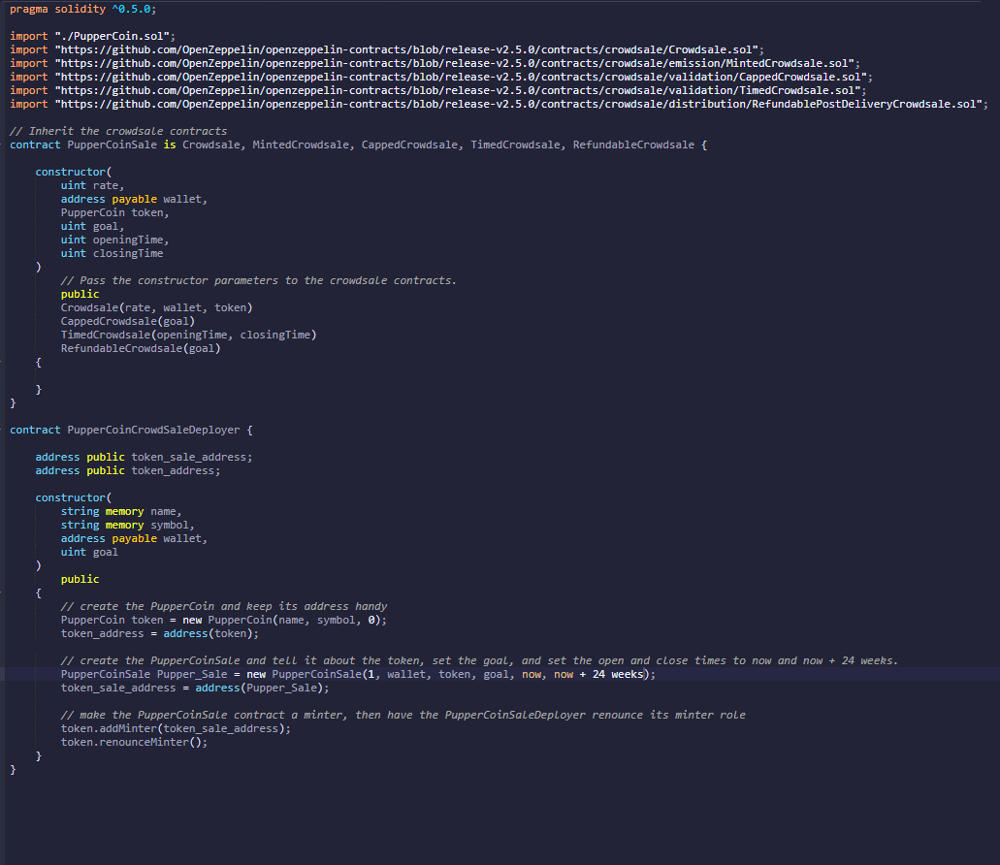
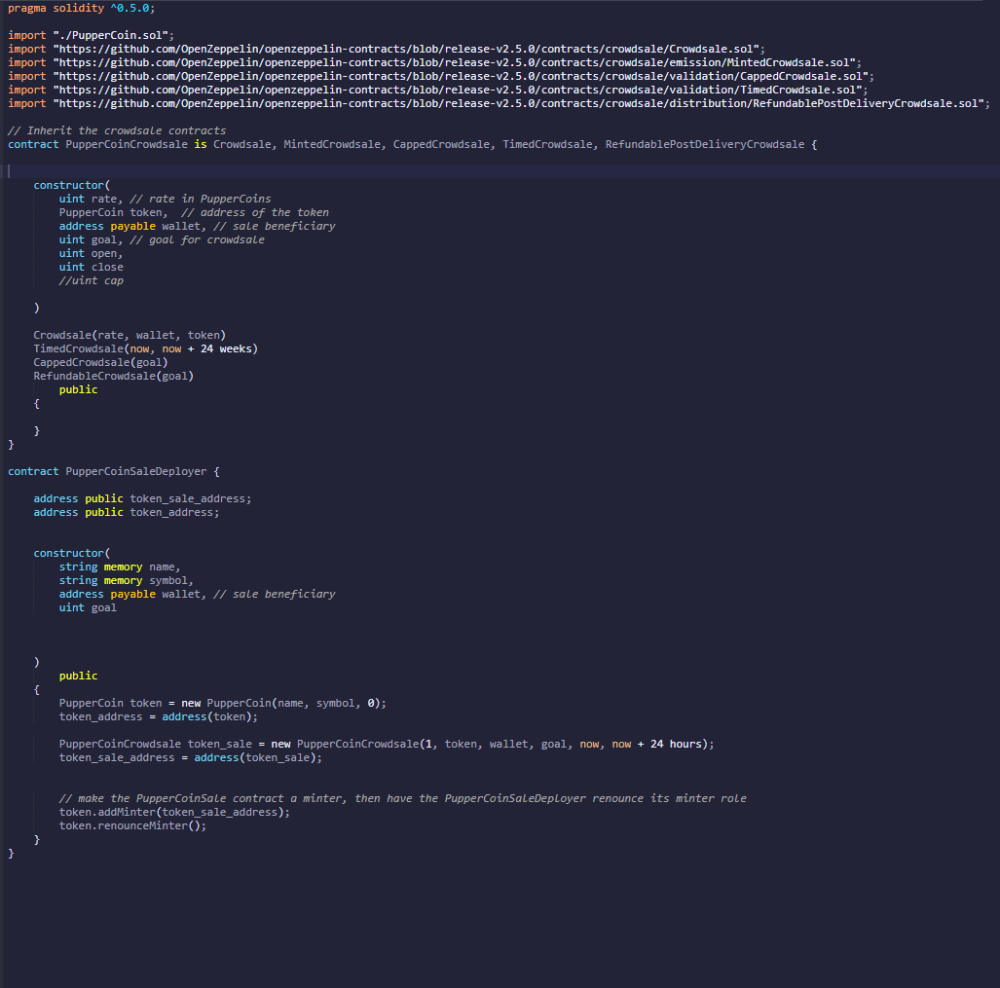

# PROCESS FOR DEPLOYING PUP COIN

## How to send Transactions

### Deploy the Contracts

    1. On the Ropsten Test Network Select the CONTRACT button and select PupperCoinSaleDeployer.sol to deploy
    
    2. Select the drop down next to the DEPLOY and enter the following:
        NAME: PUP COIN
        SYMBOL: PUPC
        WALLET: Enter appropriate wallet address for the deployer
        GOAL: 1000 or whatever amount you desire
        
    3. Select the TRANSACT button
    

    4. Select under CONTRACT tab PupperCoinCrowdsale
    
    5. Enter RATE
    
    6. Enter TOKEN address from token_sale_address button
    
    7. Enter WALLET address from token_address button
    

    8. Click TRANSACT button to deploy
    

    9. Choose the account address of your choice to buy tokens from and enter in the BUYTOKENS red button
    

    10. Click the BUYTOKENS button and confirm the transaction in Metamask (dont forget to put an amount in the VALUE in an small amount of wei, like 1000, to test)
    
    11. Confirm in Metamask
    

    12. Check the activity log in Metamask
    

    13. Confirm in Ropsten Test Network
    

### CODE SNIPPETS

#### PupperCoin.sol

#### Crowdsale.sol

#### PupperCoinCrowdSale.sol

    